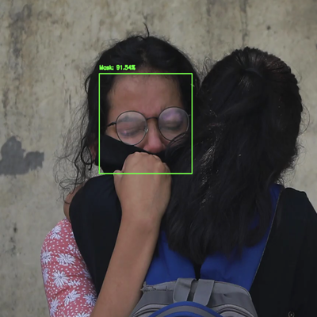
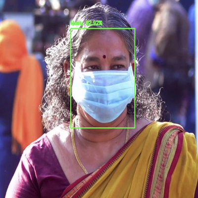
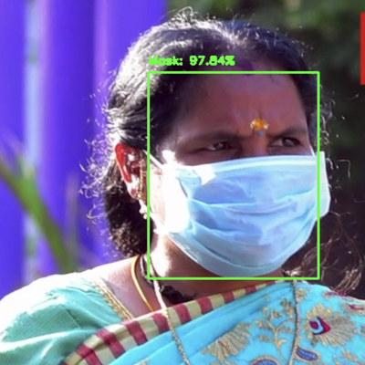
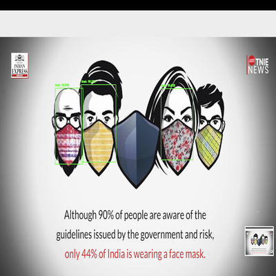
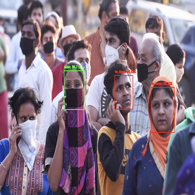
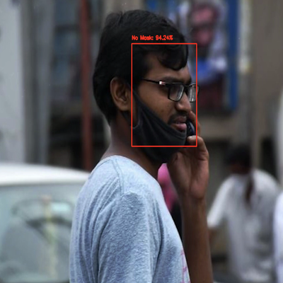
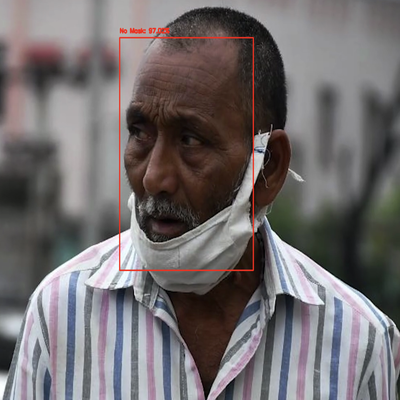
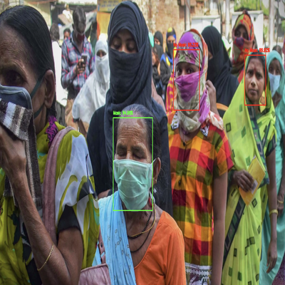
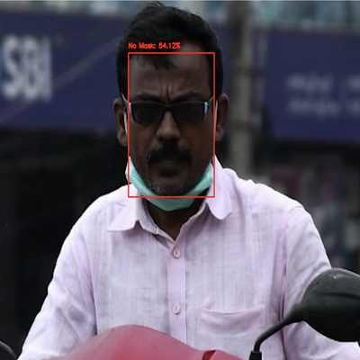
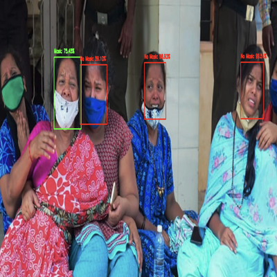

# Face Mask Detection System
A real-time face mask detection system that can detect whether a person is wearing a face mask or not. This project uses deep learning and computer vision techniques to analyze video streams.
<table>
  <tr>
    <td align="center"></td>
   <td align="center"></td>
  </tr>
</table>

## Features

- Real-time face mask detection in video streams
- High accuracy MobileNetV2-based model
- Customizable confidence threshold
- Support for both webcam and video file inputs
- Visual bounding boxes and labels with confidence scores

## How It Works

The project utilizes the following:

1.  **Face Detection:** The `face_detector` folder contains the `deploy.prototxt` and `res10_300x300_ssd_iter_140000.caffemodel` files. These are used for detecting faces in the input video stream.  It's based on the Single Shot Detector (SSD) framework with a ResNet base architecture.

2.  **Mask Classification:** The `train_mask_detector.py` script trains a custom Convolutional Neural Network (CNN) model to classify detected faces as either "with\_mask" or "without\_mask".  This trained model is saved as `either.model/.h5`.

3.  **Detection Pipeline:** The `detect_mask_video.py` script combines the face detection and mask classification steps.  It processes each frame of the input video, detects faces, classifies them, and overlays the result on the video frame.

## Code Files

  * `train_mask_detector.py`:  Script for training the face mask detection model.
  * `detect_mask_video.py`: Script for detecting face masks in video streams.
  * `face_detector/`:
      * `res10_300x300_ssd_iter_140000.caffemodel`:  Pre-trained model for face detection.
      * `deploy.prototxt`: Configuration file for the face detection model.

## Technology Stack

- Python 3.7+
- OpenCV (for computer vision tasks)
- TensorFlow/Keras (for deep learning model)
- MobileNetV2 (as base model)
- Caffe-based face detector

## Prerequisites

Before you begin, ensure you have met the following requirements:

- Python 3.7 or higher installed
- pip package manager
- Git (for cloning the repository)

## Installation

1. Clone this repository:

<pre>git clone https://github.com/MukulGupta121190/FaceMaskDetection.git
cd FaceMaskDetection </pre>

2. Install the required packages:

<pre> # Install dependencies 
  pip install -r requirements.txt 
# Train the model 
  python train_mask_detector.py --dataset dataset/ </pre>

3. You can also download the Face Detector Model (if not planning to use the one included in repo):
<pre>wget https://github.com/chandrikadeb7/Face-Mask-Detection/raw/master/face_detector/deploy.prototxt
wget https://github.com/chandrikadeb7/Face-Mask-Detection/raw/master/face_detector/res10_300x300_ssd_iter_140000.caffemodel
mkdir face_detector
mv deploy.prototxt face_detector/ 
mv res10_300x300_ssd_iter_140000.caffemodel face_detector/ </pre>

## Usage

1. Training the Model (Optional):

If you want to train your own model, ensure you have a dataset of images with and without masks.
To train the face mask detector model on your own dataset, run the following script.

<pre>python train_mask_detector.py --dataset dataset --model mask_detector.h5</pre>

This will train the model and save it as mask_detector.h5

*Note: Your dataset should have the following structure*
<pre>dataset/
    with_mask/
        image1.jpg
        image2.jpg
        ...
    without_mask/
        image1.jpg
        image2.jpg
        ...</pre>

2. Running the Face Mask Detection Model:
To detect face masks in a video file, run the below script. 

<pre>python detect_mask_video.py </pre>

Press 'q' to quit the detection window!

*Note: You will need to modify the input path and name according to your video file in the below script*
<pre>vs = cv2.VideoCapture('/Users/mukulgupta/Downloads/mask_video.mp4') </pre>

## Project Structure
<pre>
FaceMaskDetection/
├── detect_mask_video.py        # Main detection script
├── train_mask_detector.py      # Training script
├── mask_detector.h5            # Pre-trained model
├── face_detector/              # Face detection models
│   ├── deploy.prototxt
│   └── res10_300x300_ssd_iter_140000.caffemodel
├── dataset/                    # Sample training data
│   ├── with_mask/
│   └── without_mask/
├── images                      # Model Prediction results
│   ├── mask_detection/
│   └── no_mask_detection/
├── images_resized              # Resized Prediction results (just for better aesthetic in this .Readme file)
│   ├── mask_detection/
│   └── no_mask_detection/
├── requirements.txt            # Python dependencies
└── README.md                   # This file
</pre>

## Results
Here are some sample results of the mask detection in action:

### Detection With Mask
<table>
  <tr>
    <td align="center"></td>
    <td align="center"></td>
    <td align="center"></td>
    <td align="center"></td>
  </tr>
  <tr>
    <td align="center">Result 1</td>
    <td align="center">Result 2</td>
    <td align="center">Result 3</td>
    <td align="center">Result 4</td>
  </tr>
</table>

### Detection Without Mask
<table>
  <tr>
    <td align="center"></td>
    <td align="center"></td>
    <td align="center"></td>
  </tr>
  <tr>
    <td align="center">Result 1</td>
    <td align="center">Result 2</td>
    <td align="center">Result 3</td>
  </tr>
   <tr>
    <td align="center"></td>
    <td align="center"></td>
    <td align="center"></td>
  </tr>
  <tr>
    <td align="center">Result 4</td>
    <td align="center">Result 5</td>
    <td align="center">Result 6</td>
  </tr>
</table>

## Contributing
Contributions to this project are welcome! If you have any ideas for improvements, bug fixes, or new features, feel free to submit a pull request.

## Contact
- 📫 How to reach me: **mukulgupta121190@gmail.com** | **https://www.linkedin.com/in/mukulgupta0991/**

<h3 align="left">Connect with me:</h3>

